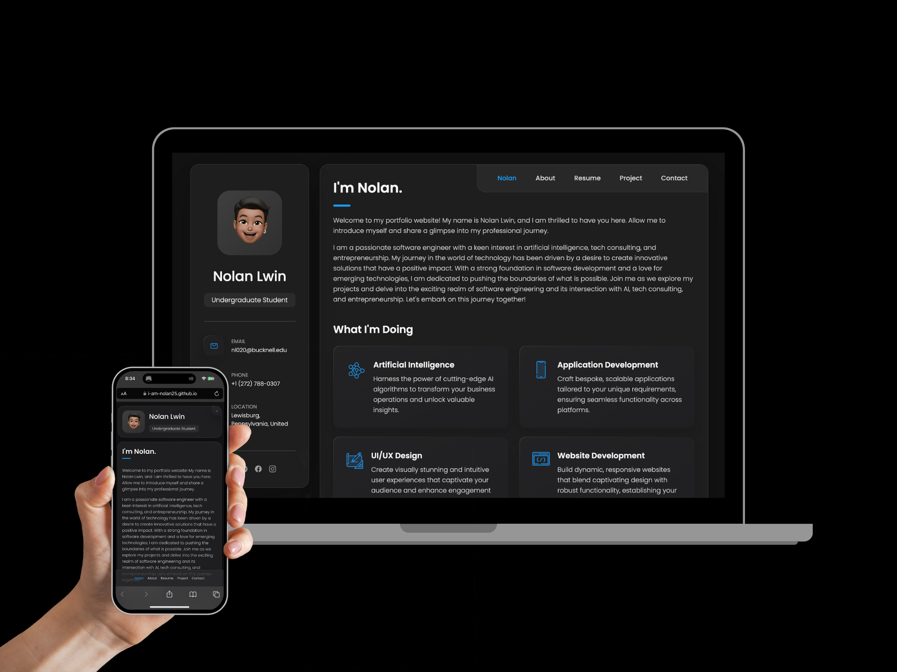

# Nolan's Personal Portfolio

This personal portfolio website boasts a fully responsive, application-like design that seamlessly adapts to all devices. 📱 💻

# Features 🚀

- Minimal Design
- Application-like user interface and experience
- Fully responsive for all devices
- Easy to Browse
- Easy to customize details
- Instagram profile supported using Instagram Basic Display API
- Contact form using Formspree.io
- Dark Mode

# Sections 🖥

- Nolan (Main)
- Sidebar
- Navbar
- About
- Resume
- Project
- Contact

# Technologies Used ⚙

This project was built using these technologies:

- HTML
- CSS
- JavaScript
- Visual Studio Code
- Git
- Github
- Instagram Basic Display API
- Formspree
- Ion-icon

# License 📄

The project is available as open source under the terms of the [MIT License](https://github.com/i-am-nolan25/Personal-Portfolio/blob/7debe883a958fa446a23434b655d6d732edb58e6/LICENSE).

# Troubleshooting 🛠

Please create an [issue](https://github.com/i-am-nolan25/Personal-Portfolio/issues).

# Acknowledgment 🎊

The project drew inspiration from [codewithsadee](https://github.com/codewithsadee) and underwent substantial modifications. The project also used [dotenv](https://github.com/motdotla/dotenv) from [Scott Motte](https://github.com/motdotla) to secure the [Instagram Basic Display API](https://developers.facebook.com/docs/instagram-basic-display-api/) access token and key. This project was built using [Node.js](https://nodejs.org/), a powerful JavaScript runtime that allowed us to run server-side code and build scalable applications. I am grateful to the Node.js community for their contributions and support.

# Contact 📬
For any inquiries, feedback, or collaboration opportunities, please feel free to reach out to me through my [email](nl020@bucknell.edu) or [LinkedIn](https://www.linkedin.com/in/naing-oo-lwin-nolan/).
